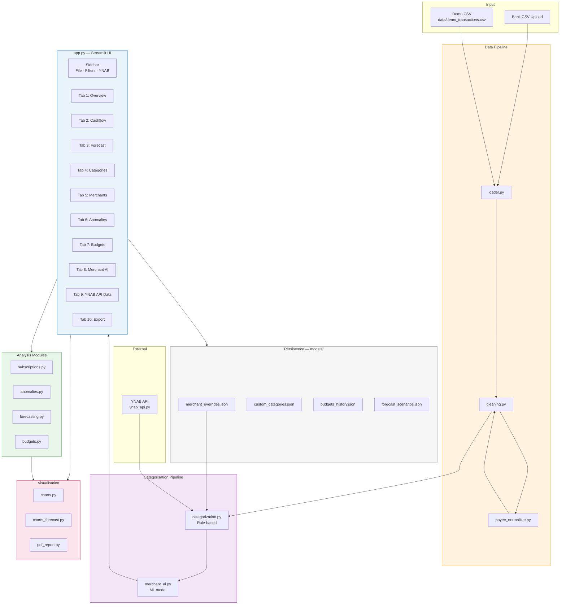
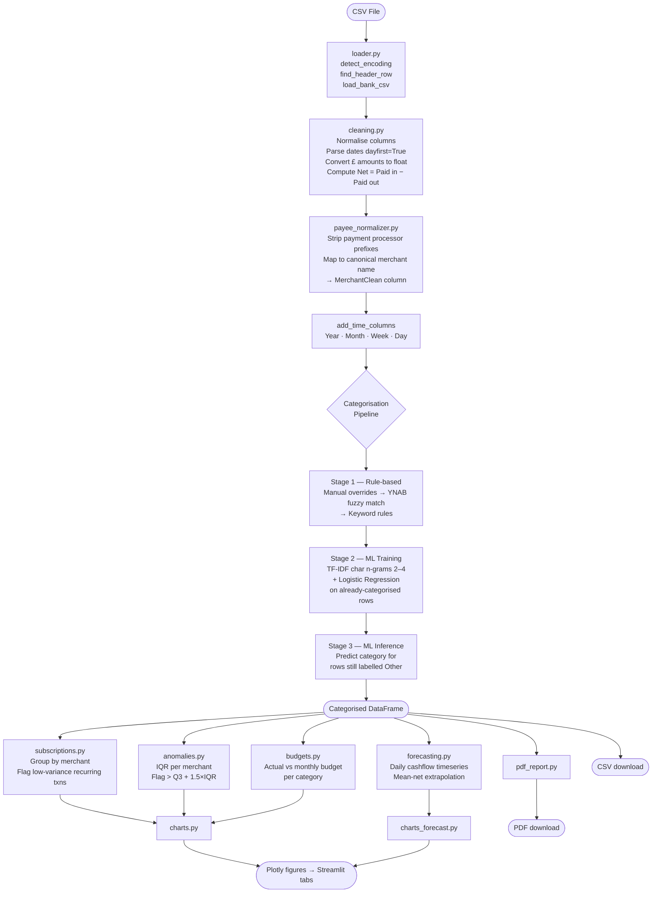
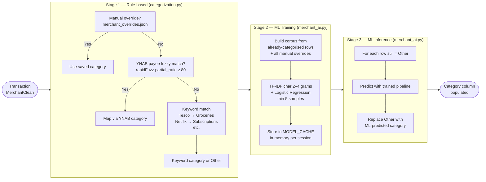
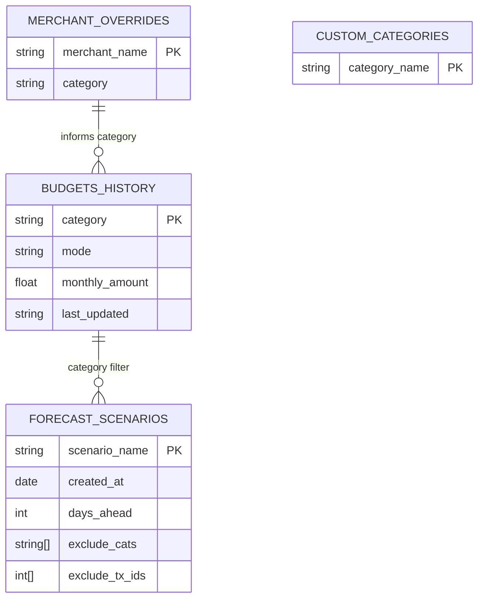
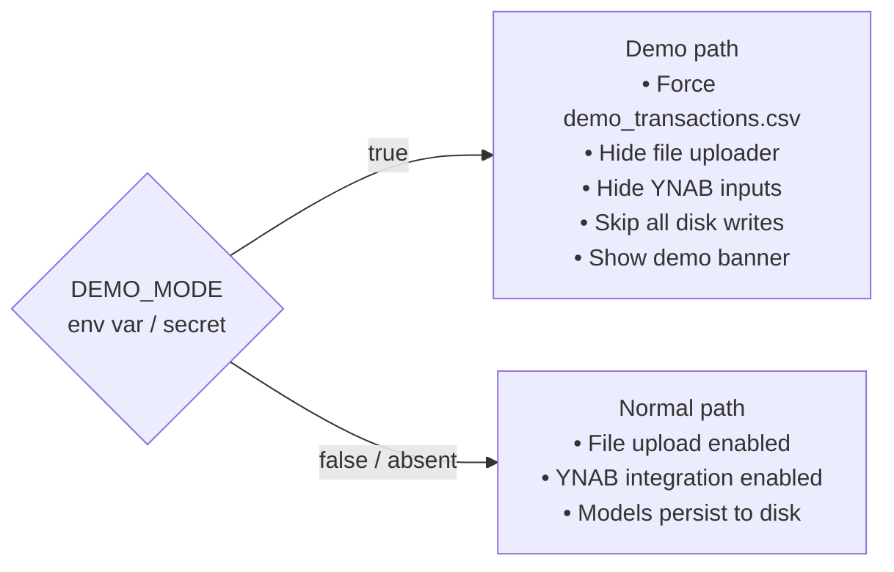

# Bank Statement Visualizer — Architecture & Functionality

A Streamlit-based personal finance dashboard that transforms raw bank CSV exports into interactive analytics. It handles transaction categorization (rule-based + ML), budget tracking, cashflow forecasting, anomaly detection, and optional YNAB integration.

---

## Table of Contents

1. [System Architecture](#system-architecture)
2. [Data Flow](#data-flow)
3. [Categorization Pipeline](#categorization-pipeline)
4. [Module Reference](#module-reference)
5. [Persistence Layer](#persistence-layer)
6. [Demo Mode](#demo-mode)
7. [Deployment](#deployment)

---

## System Architecture



---

## Data Flow



---

## Categorisation Pipeline

Three stages run in order. A transaction keeps the first category assigned to it; later stages only fill in rows still labelled **Other**.



---

## Module Reference

### Entry Point

#### `app.py`
The Streamlit application. Orchestrates all modules and renders 10 UI tabs.

| Tab | Contents |
|-----|----------|
| Overview | Balance over time, monthly stacked spend by category |
| Cashflow | Daily net bar chart, cumulative cashflow line |
| Forecast | Cumulative forecast with scenario overlay |
| Categories | Multi-line category trends over time |
| Merchants | Top 15 merchants, subscription detection table |
| Anomalies | Scatter plot with IQR-flagged outliers highlighted |
| Budgets | Actual vs budget per category, budget settings editor |
| Merchant AI | Manual category overrides, custom category management |
| YNAB API Data | Raw YNAB budget/category data viewers |
| Export | CSV download, PDF summary report |

Key functions:
- `load_data_from_source()` — cached CSV load + clean
- `apply_full_categorisation()` — chains rule-based → ML
- `sidebar_filters()` — date range + category multiselect
- `merchant_editor()` — interactive override UI

---

### Data Pipeline

#### `utils/loader.py`
Robust CSV parsing for bank statements (designed for Halifax format with metadata rows above the header).

- `detect_encoding()` — chardet-based; handles Windows-1252 `£` symbols
- `find_header_row()` — scans rows until "Date" column found
- `load_bank_csv()` — `pd.read_csv` with thousands separator and encoding fallback
- `choose_data_source()` — priority: demo → uploaded file → `data/*.csv`

#### `utils/cleaning.py`
Standardises the raw DataFrame into a consistent schema.

- `clean_bank_dataframe()` — normalises columns, parses dates (`dayfirst=True`), converts monetary strings to float, calls `normalize_payee()` to populate `MerchantClean`
- `add_time_columns()` — appends `Year`, `Month`, `Week`, `Day` columns
- `split_income_expense()` — returns `(income_df, expense_df)` tuples

#### `payee_normalizer.py`
460-line module that canonicalises messy merchant strings. Single public entry point: `normalize_payee(raw_name)`.

Pipeline (applied in order):
1. Hard-coded special cases (ATM, cheques, Pirbright codes, Nationwide cashback)
2. Transfer pattern detection → `"Transfer – Foo"`
3. Iterative prefix stripping (ZETTLE, SUMUP, SQ, SP, PAYPAL, VMS, …)
4. Location token stripping (GB, UK, country names)
5. 200+ entry `CANONICAL_MAP` lookup (`"tesco"` → `"Tesco"`)
6. Final whitespace collapse and encoding cleanup

---

### Categorisation

#### `utils/categorization.py`
Applies rule-based categories in priority order (see pipeline diagram above). Uses `rapidfuzz.partial_ratio` for YNAB fuzzy matching with a threshold of 80.

#### `utils/category_mapping.py`
Maps YNAB category names to dashboard category names (~75 mappings). Used by `ynab_api.py` when importing YNAB data.

#### `utils/merchant_ai.py`
Trains and applies a lightweight ML categoriser.

- **Model:** `sklearn.Pipeline` — `TfidfVectorizer(analyzer='char', ngram_range=(2,4))` → `LogisticRegression`
- **Training data:** rows from the current DataFrame with non-Other categories, plus all manual overrides
- **Minimum corpus:** 5 samples required to train
- **Cache:** `MODEL_CACHE` dict (in-memory, survives Streamlit reruns within one session)
- **Demo mode:** training still runs but writes to disk are skipped

---

### Analysis

#### `utils/subscriptions.py`
Detects recurring charges using statistical heuristics.

- Groups expenses by merchant, requires ≥ 3 transactions
- Flags where `std / mean < 0.2` (low relative variability)
- Returns: `Merchant · Tx count · Avg amount · Std dev · Rel std`

#### `utils/anomalies.py`
IQR-based outlier detection per merchant.

- Computes Q1, Q3, IQR per merchant group
- Flags any transaction where `Paid out > Q3 + 1.5 × IQR`
- Returns anomalies sorted descending by amount

#### `utils/forecasting.py`
Simple cashflow time series and forward projection.

- `build_cashflow_timeseries()` — groups by `Date`, sums `Net`, computes `cumsum()`
- `add_simple_forecast()` — extrapolates using constant mean daily net for N days
- Output has a `Type` column: `"Actual"` or `"Forecast"`

#### `utils/budgets.py`
Manages budget history and computes actual vs budget.

- `load_budget_history()` / `save_budget_history()` — JSON persistence
- `update_history_from_ynab()` — merges current-month YNAB budgets
- `compute_budget_vs_actual()` — returns `Category · Actual · Budget · Delta · PercentOver · Mode`

Budget modes:

| Mode | Meaning |
|------|---------|
| `manual` | User-entered monthly amount |
| `stable` | Fixed recurring cost (e.g. mortgage) |
| `ynab` | Amount pulled from YNAB current month |

---

### Visualisation

#### `utils/charts.py`
Plotly Express wrappers for all standard charts.

| Function | Chart type | Data |
|----------|-----------|------|
| `fig_balance_over_time` | Line | Cumulative net balance |
| `fig_monthly_spend_stacked` | Stacked bar | Spend by category × month |
| `fig_daily_net_cashflow` | Bar | Daily net (income − expense) |
| `fig_cumulative_cashflow` | Line | Running cashflow total |
| `fig_category_trends` | Multi-line | Category spend over time |
| `fig_top_merchants` | Horizontal bar | Top 15 merchants by spend |
| `fig_anomalies_scatter` | Scatter | Anomalies highlighted in red |

#### `utils/charts_forecast.py`
Forecast chart with scenario overlay.

- Blue solid line: historical cumulative actual
- Orange dotted line: forecast projection
- Green line (optional): actual performance since scenario creation
- Vertical dashed line at scenario creation date

#### `utils/pdf_report.py`
Generates a one-page PDF using ReportLab.

- Summary metrics: Total In · Total Out · Net
- Top 10 categories by spend
- Returned as `BytesIO` for Streamlit `download_button`

---

### External Integration

#### `utils/ynab_api.py`
HTTP client for the [YNAB API](https://api.ynab.com).

`YNABClient` dataclass methods:
- `list_budgets()` / `get_categories()` / `get_current_month_categories()`
- `get_payees()` / `get_transactions_since(since_date)`

Convenience functions:
- `fetch_current_month_category_budgets()` — DataFrame of YNAB budget state (converts milliunits → £)
- `build_payee_category_overrides()` — dict of normalised payee names → dashboard categories for fuzzy matching
- `fetch_all_ynab_categories()` — flat list of all visible category names

All calls cached with `@st.cache_data` to reduce API traffic.

---

### Support Modules

#### `utils/demo_mode.py`
Controls public deployment behaviour.

- `is_demo()` — checks `DEMO_MODE` in Streamlit secrets or `os.environ`
- `demo_banner()` — shows a prominent info banner in the UI
- `demo_data_path()` — returns `Path("data/demo_transactions.csv")`

In demo mode: file uploader hidden, YNAB inputs hidden, all disk writes become no-ops.

#### `utils/budget_settings.py`
Streamlit UI component for editing budget configuration. Renders a three-column table (category name · mode selector · monthly amount input). Changes are written back to the history dict; the user must click **Save** to persist.

#### `utils/scenario_storage.py`
Loads and saves forecast scenarios to `models/forecast_scenarios.json`.

- Handles backwards compatibility (auto-upgrades missing fields)
- Serialises `exclude_tx_ids` as ints and `exclude_cats` as strings

#### `scripts/generate_demo_data.py`
Generates synthetic bank statement CSV in Halifax FlexDirect format.

- Date range: Jan 2024 – Nov 2025 (~1,200 transactions)
- Opening balance: £8,500 · Monthly salary: £3,850
- 16 fixed direct debits + variable expenses across 9 categories
- 5 deliberate anomalies inserted for testing
- Reproducible: `numpy` seed 42

---

## Persistence Layer



| File | Purpose |
|------|---------|
| `models/merchant_overrides.json` | User-curated merchant → category mappings |
| `models/custom_categories.json` | User-defined category names |
| `models/budgets_history.json` | Per-category budget config (mode + monthly amount) |
| `models/forecast_scenarios.json` | Saved forecast scenarios for comparison over time |

All writes are silently skipped when `DEMO_MODE` is active.

---

## Demo Mode



Activate by setting `DEMO_MODE = "true"` in `.streamlit/secrets.toml`.

---

## Deployment

### Local

```bash
streamlit run app.py
```

CSV uploads work normally; all model files persist to `models/`.

### Streamlit Cloud (public demo)

1. Generate demo data: `python scripts/generate_demo_data.py`
2. Set secret: `DEMO_MODE = "true"` in `.streamlit/secrets.toml`
3. Deploy — the app runs read-only against the bundled CSV.

### Key Dependencies

| Package | Purpose |
|---------|---------|
| `streamlit` | UI framework |
| `pandas` / `numpy` | Data manipulation |
| `plotly` | Interactive charts |
| `scikit-learn` | TF-IDF + Logistic Regression |
| `rapidfuzz` | Fuzzy merchant matching |
| `chardet` | CSV encoding detection |
| `reportlab` | PDF generation |
